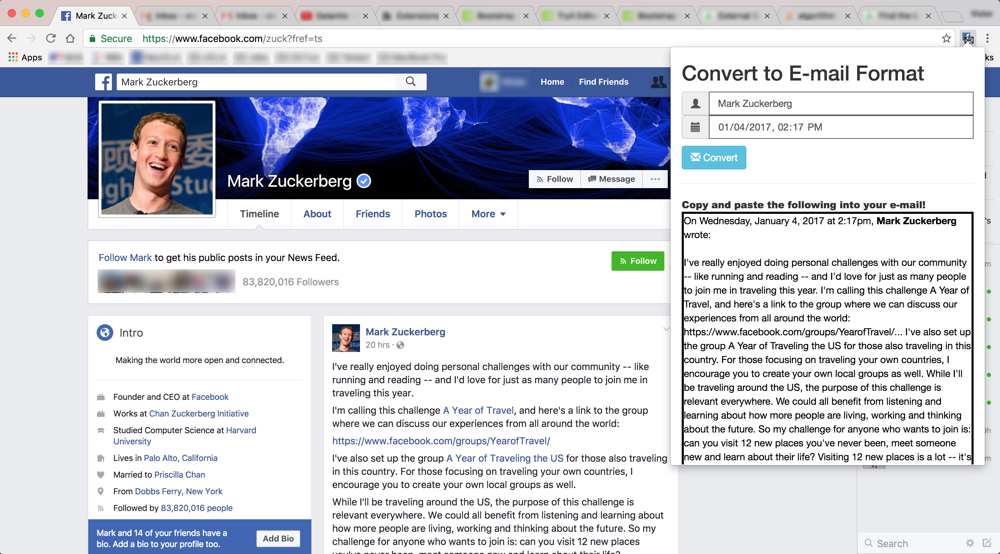

# Synopsis

*FB2Email* is a personal side project in development which creates a Google Chrome extension that enables the user to convert Facebook posts to a format that is readable and more applicable for e-mail. 

# Development

Users can convert a Facebook post in one of two ways.  They can click on the extension icon and enter the name and timestamp of the post that they wish to convert, and the contents of the post will be displayed below the form.  Alternatively, users can click on the E-mail button next to the timestamp of each post directly on the Facebook page, and the contents of the post will be displayed in a modal window.

The following is a list of features currently in development.
⋅⋅*Inclusion of media objects, including videos and pictures
⋅⋅*Implementation of Email button to directly open e-mail client with the contents of the Facebook post in the body of the e-mail draft.

# Installation

The step-by-step procedure to load this extension can be viewed in this <a href="https://developer.chrome.com/extensions/getstarted#unpacked" target="_blank">link</a>.
