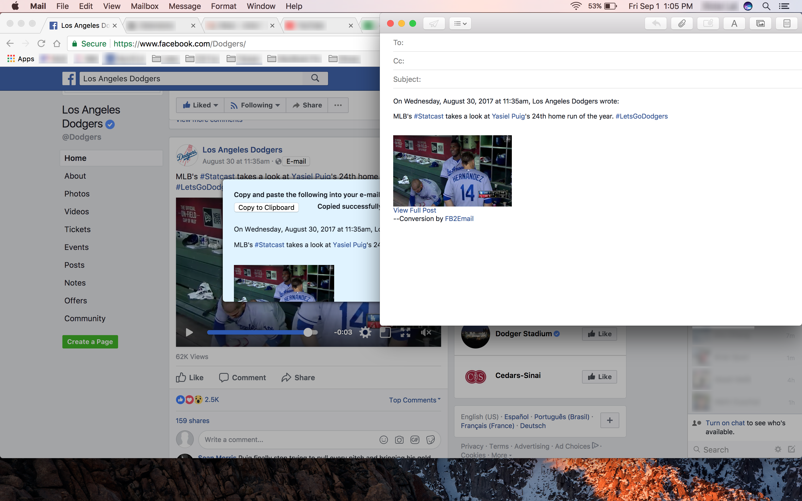
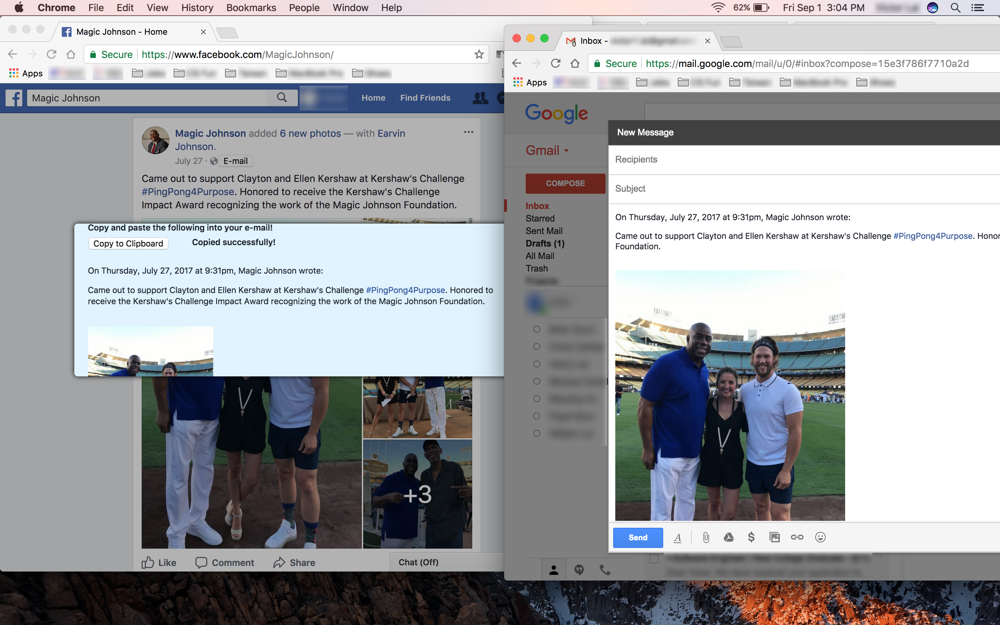
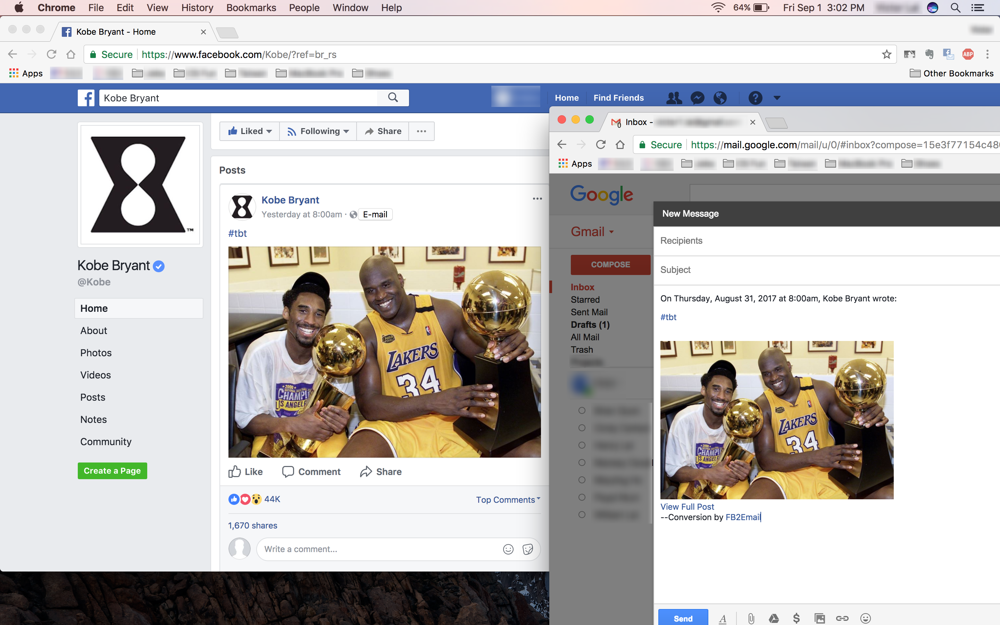

# FB2Email

## Synopsis

*FB2Email* is a personal side project in development which creates a Google
Chrome extension that enables the user to convert Facebook posts to a format
that is readable and more applicable for e-mail :email:. 

## Usage

Users can click on the E-mail button next to the timestamp of
each post directly on the Facebook page, and the contents of the post will be
displayed in a modal window, where it can then be conveniently copied to the
clipboard.

The following are a few sample conversions.

Not all types of Facebook posts are supported for converion yet.

Previously, users could click on the extension icon and enter the name and
timestamp of the post that they wish to convert, and the contents of the post
will be displayed below the form. That functionality will be deprecated soon.
Settings and configuration will instead be placed in the popup page.

## Development

The following is a list of ideas for features to implement.

- [x] Manually indicate post to convert in popup.
- [x] Email button placed next to basic posts
- [x] Basic text supported in conversions
- [ ] Long posts (with *See More*) supported in conversions
- [ ] Links supported in conversions
- [ ] Media objects (i.e. videos, images, albums) supported in conversions
- [ ] E-mail button placed next to a post within a post (possibly a post shared by someone else)
- [ ] Deprecate feature to make conversion in popup page.

If you have an idea that's not listed, please make a feature request by
creating a new issue.

## Installation

Download or clone this repository.

The step-by-step procedure to load this extension can be viewed in this
[link](https://developer.chrome.com/extensions/getstarted#unpacked).
